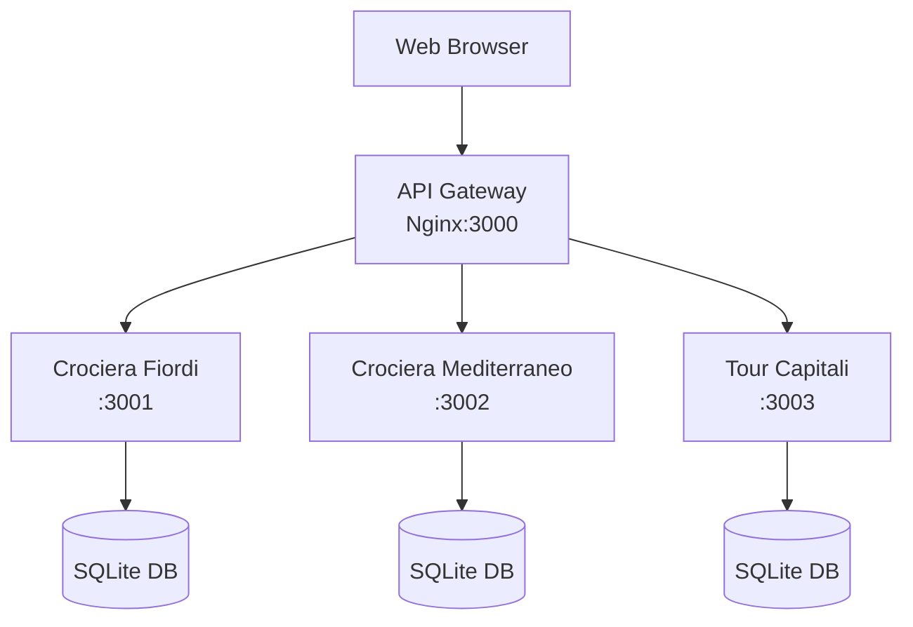

# Event Form Suite - Microservices Architecture

A containerized event registration system with isolated form instances and API gateway routing.

## 🏗️ Architecture



## 🚀 Quick Start

### Prerequisites
- Docker Desktop 20.10+
- Docker Compose 1.29+
- 4GB RAM minimum

### Deploy Microservices

**Windows:**
```cmd
deploy-microservices.bat
```

**Linux/Mac:**
```bash
chmod +x deploy-microservices.sh
./deploy-microservices.sh
```

### Access Your Forms

- **Crociera Fiordi**: http://localhost:3000/crociera-fiordi/
- **Crociera Mediterraneo**: http://localhost:3000/crociera-mediterraneo/
- **Tour Capitali**: http://localhost:3000/tour-capitali/

### Admin Panels

Add `/admin` to any form URL:
- http://localhost:3000/crociera-fiordi/admin
- http://localhost:3000/crociera-mediterraneo/admin
- http://localhost:3000/tour-capitali/admin

## 📂 Project Structure

```
event-form-suite/
├── docker-compose.microservices.yml  # Main orchestration
├── nginx/
│   └── nginx.conf                     # API Gateway config
├── services/
│   ├── base/                          # Shared service template
│   │   ├── Dockerfile
│   │   └── service.js
│   ├── crociera-fiordi/
│   │   └── Dockerfile                 # Service-specific build
│   ├── crociera-mediterraneo/
│   │   └── Dockerfile
│   └── tour-capitali/
│       └── Dockerfile
├── forms/                             # Form definitions (copied to services)
├── utils/                             # Shared utilities
├── deploy-microservices.bat           # Windows deployment
└── deploy-microservices.sh            # Linux/Mac deployment
```

## 🔧 Management Commands

### View Logs
```bash
# All services
docker-compose -f docker-compose.microservices.yml logs -f

# Specific service
docker-compose -f docker-compose.microservices.yml logs -f form-crociera-fiordi
```

### Stop Services
```bash
docker-compose -f docker-compose.microservices.yml down
```

### Restart Services
```bash
# All services
docker-compose -f docker-compose.microservices.yml restart

# Specific service
docker-compose -f docker-compose.microservices.yml restart form-crociera-fiordi
```

### Scale Services
```bash
# Scale specific service
docker-compose -f docker-compose.microservices.yml up -d --scale form-crociera-fiordi=2
```

## 🏥 Health Checks

Each service includes health checks:

- **Gateway**: http://localhost:3000/health
- **Individual services**: Checked automatically by Docker

Monitor service status:
```bash
docker ps --format "table {{.Names}}\t{{.Status}}\t{{.Ports}}"
```

## 📊 Service Details

| Service | Port | Internal Port | Database Location |
|---------|------|---------------|-------------------|
| API Gateway | 3000 | 80 | N/A |
| Crociera Fiordi | N/A | 3001 | `/app/data/database.sqlite` |
| Crociera Mediterraneo | N/A | 3002 | `/app/data/database.sqlite` |
| Tour Capitali | N/A | 3003 | `/app/data/database.sqlite` |

## 🔒 Security Features

- **Container Isolation**: Each service runs in isolated containers
- **Internal Networking**: Services communicate via internal Docker network
- **Gateway Protection**: External access only through API Gateway
- **Volume Persistence**: Data persisted in Docker volumes

## 🛠️ Development

### Adding New Form Instance

1. Create form in `forms/new-form-name/`
2. Create `services/new-form-name/Dockerfile`
3. Update `docker-compose.microservices.yml`
4. Update `nginx/nginx.conf`
5. Redeploy: `./deploy-microservices.sh`

### Local Development

For development with hot reload:
```bash
# Use development compose file (create if needed)
docker-compose -f docker-compose.dev.yml up
```

## 📈 Monitoring

### Resource Usage
```bash
# Check container resources
docker stats

# Check specific service
docker stats form-crociera-fiordi
```

### Database Backup
```bash
# Backup service data
docker cp form-crociera-fiordi:/app/data/database.sqlite ./backup-fiordi.sqlite
```

## 🔄 Migration from Monolith

See [MICROSERVICES_MIGRATION.md](MICROSERVICES_MIGRATION.md) for detailed migration instructions.

## 🆘 Troubleshooting

### Service Won't Start
```bash
# Check logs
docker-compose -f docker-compose.microservices.yml logs {service-name}

# Inspect container
docker inspect {container-name}
```

### Port Conflicts
```bash
# Check what's using port 3000
netstat -tulpn | grep :3000  # Linux
netstat -an | findstr :3000  # Windows
```

### Gateway Issues
```bash
# Test nginx config
docker exec -it event-form-gateway nginx -t

# Reload nginx
docker exec -it event-form-gateway nginx -s reload
```

## 🔄 Rollback to Monolith

If needed, rollback to the original monolithic architecture:

```bash
# Stop microservices
docker-compose -f docker-compose.microservices.yml down

# Start original monolith
docker-compose -f docker-compose.yml up -d
```

## 📞 Support

For issues or questions:
1. Check logs first: `docker-compose logs`
2. Review troubleshooting section
3. Create an issue in the repository

## 🛣️ Roadmap

- [ ] Prometheus monitoring
- [ ] Centralized logging (ELK Stack)
- [ ] Service mesh (Istio)
- [ ] Auto-scaling capabilities
- [ ] Blue-green deployments 